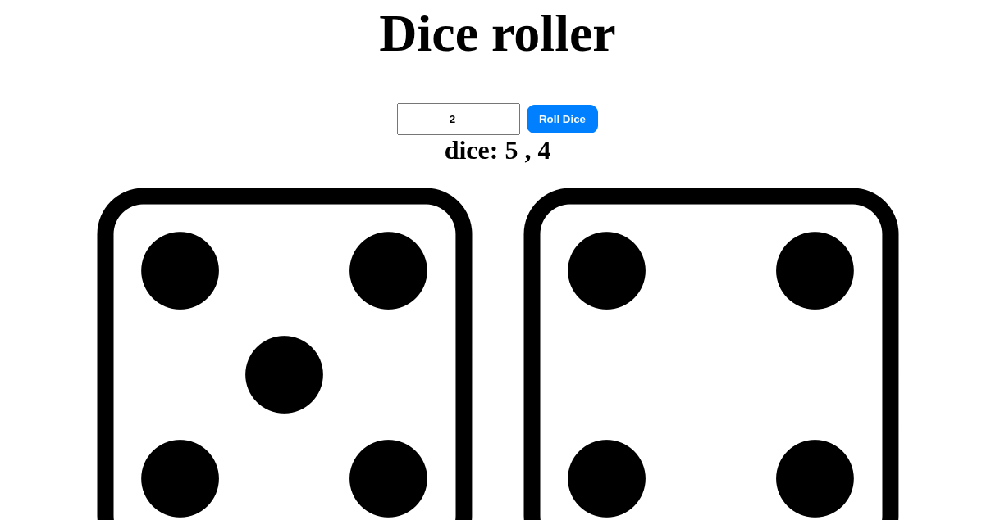

# 🎲 MagicDice

**MagicDice** is a fun and simple dice roller web app that simulates the rolling of one or multiple dice with just a click. Instantly view the dice numbers and corresponding images!

---

## 🚀 Features

- 🎯 Roll 1 or more dice at once
- 🎲 Displays random dice images based on roll
- ⚡ Fast and interactive user experience
- ✅ Simple, clean, and responsive UI

---

## 🛠️ Tech Stack

- **HTML5**
- **CSS3**
- **JavaScript (Vanilla)**

---

## 📸 Preview
`
   
*(Make sure to add a screenshot at this location)*

---

## 📂 Project Structure

````
MagicDice/
├── index.html
├── style.css
├── script.js
└── img/
├── 1.png
├── 2.png
├── 3.png
├── 4.png
├── 5.png
└── 6.png
````

---

## ✅ How to Use

1. Clone or download this repository.
2. Open `index.html` in your browser.
3. Enter the number of dice you want to roll.
4. Click the **"Roll Dice"** button.
5. Watch the magic! 🎲✨

---

## 📌 Future Ideas

- Add sound effects when rolling dice.
- Include different dice types (D4, D20, etc.).
- Track previous rolls or history.
- Mobile optimization.

---

## 👨‍💻 Author

**Mohammad Hasib Hasan**  
GitHub: [@HasibCoderLab](https://github.com/HasibCoderLab)

---

## 📄 License

This project is licensed under the MIT License.
